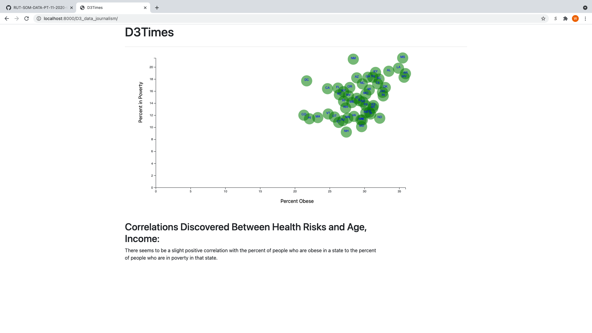

# Data-Journalism
The objective of this repository was to utilize D3.js to construct plots and put those plots on a webpage. The data used for the plot came from csv file that contained United States census data from the year 2014. D3 was used to read the csv and then make a scatter plot from the data. The two variables of interest in the scatter plot were percent obese per state and percent of people in poverty per state. From the appearance of the plot, there seemed to be a slight correlation between the two. The image of the resulting plot can be seen here. 

